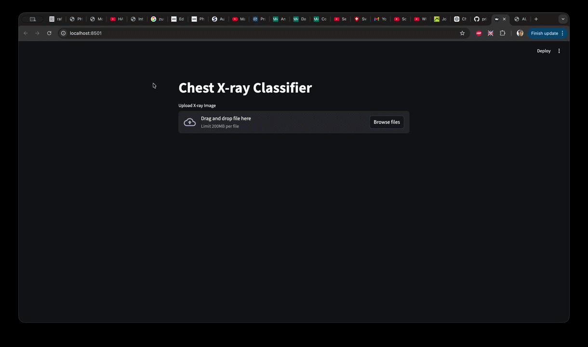

# 🩺 Chest X-ray Classifier (Deep Learning + Web App)

<p align="center">
  
</p>

A full-stack deep learning project that classifies chest X-ray images into three categories:

* Lung Opacity
* Viral Pneumonia
* Normal

It combines a CNN model, Flask API backend, and Streamlit frontend to deliver real-time predictions.

---

## 🚀 What this project does

Here’s the thing — this isn’t just a model sitting in a notebook.

You’ve built a complete pipeline:

* Image preprocessing using OpenCV
* CNN model training using TensorFlow/Keras
* Model evaluation with K-Fold Cross Validation
* ROC-AUC performance analysis
* Flask API for serving predictions
* Streamlit UI for user interaction

Upload an X-ray → get predictions instantly.

---

## 🧠 Model Architecture

A custom Convolutional Neural Network (CNN):

* 3 Convolution layers (32, 64, 128 filters)
* MaxPooling after each conv layer
* Fully connected dense layer (128 units)
* Output layer with Softmax (3 classes)

**Loss Function:** Sparse Categorical Crossentropy
**Optimizer:** Adam

---

## 📊 Evaluation

* K-Fold Cross Validation (k=5)
* Average accuracy across folds
* ROC Curve + AUC score for each class

This gives a more reliable performance estimate instead of relying on a single train-test split.

---

## 🗂️ Dataset Structure

```
dataset/
│
├── lung_opacity/
├── viral_pneumonia/
└── normal/
```

Images are resized to **224 × 224** and normalized before training.

---

## ⚙️ Installation

Clone the repository:

```bash
git clone https://github.com/your-username/chest-xray-classifier.git
cd chest-xray-classifier
```

Install dependencies:

```bash
pip install -r requirements.txt
```

---

## 🏋️‍♂️ Training the Model

Run the training script:

```bash
python train_model.py
```

This will:

* Train using K-Fold cross validation
* Plot ROC curves
* Save the trained model:

```
lung_xray_model.h5
```

---

## 🔌 Backend (Flask API)

Start the backend server:

```bash
python api.py
```

Runs on:

```
http://127.0.0.1:5000
```

### Endpoint:

**POST /predict**

* Input: X-ray image file
* Output: JSON with class probabilities

Example response:

```json
{
  "lung_opacity": 0.72,
  "viral_pneumonia": 0.18,
  "normal": 0.10
}
```

---

## 💻 Frontend (Streamlit App)

Run the frontend:

```bash
streamlit run app.py
```

What this gives you:

* Upload X-ray image
* View prediction instantly
* See probability distribution as a chart

---

## 🔄 How to run everything together

Open two terminals:

**Terminal 1 (Backend):**

```bash
python api.py
```

**Terminal 2 (Frontend):**

```bash
streamlit run app.py
```

Then open the Streamlit app in your browser.

---

## 🖼️ Demo

Add your demo GIF like this:

```markdown

```

---

## 📌 Key Features

* End-to-end ML system (not just a model)
* Real-time prediction pipeline
* Clean separation: training / backend / frontend
* Medical imaging use case (high impact domain)

---

## ⚠️ Disclaimer

This project is for educational and research purposes only.
It is **not intended for clinical diagnosis** or medical use.

---

## 🔮 Future Improvements

* Use transfer learning (ResNet, EfficientNet)
* Add Grad-CAM for explainability
---

## 👤 Author

**Prince Khera**
